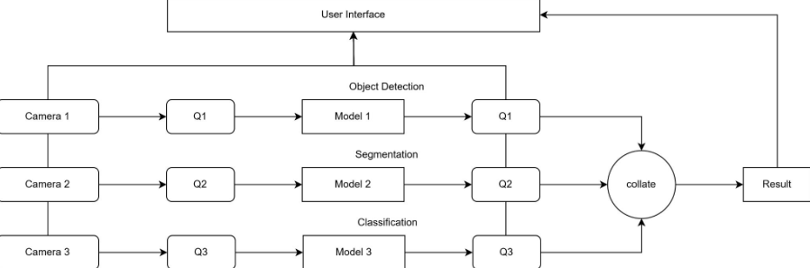

# VisualAI_hackathon
## SafeWatch
### Description
**SafeWatch** is a system designed to prevent anomalies in industrial products, ensuring user safety. Each product is captured by three cameras, and the images undergo **object detection**, **segmentation**, and **classification** processes. The results from these three pipelines are aggregated and analyzed to generate a final decision, effectively filtering out defective items.

### Model
- Object Detection: YOLOv8
- Segmentation: YOLOv8
- Classification: EasyOCR

### Dataset
https://www.kaggle.com/datasets/kubeedgeianvs/pcb-aoi